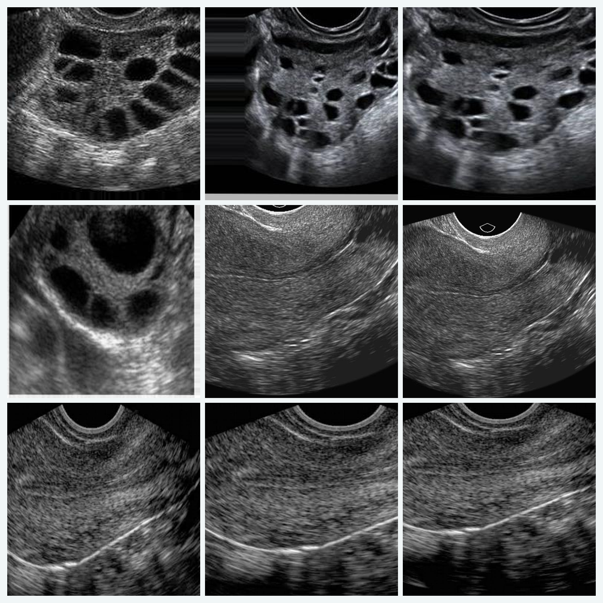

# Endometrial Infection Classification App - Streamlit Edition

<p align="center">
  <a href="https://github.com/okonp07/endometrial-infection-classification-streamlit-app">
    
  </a>
</p>

<p align="center">
  <a href="https://github.com/okonp07/endometrial-infection-classification-streamlit-app">
    
  </a>
  
  
  <a href="https://github.com/okonp07/endometrial-infection-classification-streamlit-app/actions">
    
  </a>
  <a href="https://github.com/okonp07/endometrial-infection-classification-streamlit-app/blob/main/LICENSE">
    
  </a>
</p>

<p align="center">
  Near pixel-faithful Streamlit reproduction of the Endometrial Infection Classification App, preserving the same research content, UX flow, model assets, and interpretability views in a Streamlit deployment format.
</p>

<p align="center">
  <a href="https://github.com/okonp07/endometrial-infection-classification-streamlit-app"><strong>Open the Streamlit deployment repo</strong></a>
</p>

## Streamlit Deployment Repo

This repository contains the Streamlit deployment version of the project:

### [Open the Streamlit deployment repository](https://github.com/okonp07/endometrial-infection-classification-streamlit-app)

It reproduces the current classifier experience in Streamlit while reusing the same model, author information, downloadable demo pack, EDA content, feedback logging, and research framing.

## Streamlit Cloud deployment note

If you deploy this repository on Streamlit Community Cloud:

- choose **Python 3.12** in the app's advanced settings
- set the main file to **`streamlit_app.py`**
- if a previous deployment was created with the wrong Python version, delete it and redeploy because the Python version is chosen at creation time

If Streamlit accidentally points at `app.py`, the repo now falls back to the Streamlit UI automatically, but `streamlit_app.py` remains the intended entrypoint.

## Overview

This repository is a Streamlit-focused deployment scaffold for serving an endometrial image classifier with:

- `FastAPI` for the prediction API
- `Streamlit` for the primary browser UI
- shared model/service code reused from the current production app
- `Docker` for packaging
- `GitHub Actions` for free CI/CD
- `DVC` for local artifact versioning without requiring a paid backend

## Zero-cost architecture

This setup stays on the free path by using:

- a public GitHub repository
- Streamlit-ready app entrypoints and config
- GitHub Actions on the free tier
- DVC for local artifact management, with no paid remote required by default

What is deliberately not included:

- no paid cloud VM
- no paid database
- no paid model registry
- no paid inference endpoint

## Project structure

```text
endometrial-infection-classification-streamlit-app/
├── .streamlit/
│   └── config.toml
├── .github/workflows/
│   ├── ci.yml
│   └── sync-hf-space.yml
├── .dvc/
│   ├── .gitignore
│   └── config
├── artifacts/
│   ├── audit/
│   └── class_names.json
├── docs/
│   ├── deployment.md
│   └── zero-cost-stack.md
├── models/
│   └── .gitkeep
├── scripts/
│   ├── export_model_artifacts.py
│   └── train_from_archives.py
├── src/endometrial_app/
│   ├── api.py
│   ├── config.py
│   ├── model.py
│   ├── schemas.py
│   ├── service.py
│   ├── streamlit_ui.py
│   └── ui.py
├── tests/
│   ├── test_api.py
│   ├── test_data_prep.py
│   ├── test_streamlit_ui.py
│   └── test_service.py
├── app.py
├── Dockerfile
├── Makefile
├── dvc.yaml
├── future development.md
├── requirements-ci.txt
├── requirements.txt
└── streamlit_app.py
```

## How the app works

1. Your notebook trains the classifier.
2. You export the chosen inference model into the `models/` directory.
3. The app loads the model at startup.
4. FastAPI exposes the prediction API.
5. Gradio provides the web interface on top of the same prediction service.
6. `streamlit_app.py` provides a near pixel-faithful Streamlit clone that reuses the same model, assets, copy, and audit artifacts.
7. GitHub Actions tests the code and can sync the repo to a Hugging Face Docker Space.

## Model contract

The production app expects:

- a TensorFlow/Keras model at `models/endometrial_classifier.keras`, or a custom path via `MODEL_PATH`
- class names at `artifacts/class_names.json`
- an exported inference model that already contains any required preprocessing logic, or a model that expects resized RGB images shaped as `224 x 224`

The default class order is:

```json
["infected", "uninfected"]
```

If your model outputs a single sigmoid probability, the app treats that probability as the score for `uninfected`, and computes `infected` as `1 - p`.

## Export your notebook model

After training in the notebook, save the final model and register the class names:

```bash
python scripts/export_model_artifacts.py \
  --model /absolute/path/to/final_model.keras \
  --output-model models/endometrial_classifier.keras \
  --labels infected uninfected
```

This script copies the trained model into the app layout and writes `artifacts/class_names.json`.

## Or train directly from the original zip files

If you have not yet exported a model from the notebook, this repo can train one directly from your two archives:

```bash
python scripts/train_from_archives.py \
  --infected-zip "/Users/researchanddevelopment2/Desktop/Endometrial Infection Image Classification Using TensorFlow/infected.zip" \
  --uninfected-zip "/Users/researchanddevelopment2/Desktop/Endometrial Infection Image Classification Using TensorFlow/notinfected.zip"
```

That command will:

- extract the images
- remove exact duplicates
- build perceptual-similarity groups to reduce near-duplicate leakage
- create train, validation, and test splits at the similarity-group level
- train a MobileNetV2-based classifier
- save the final model to `models/endometrial_classifier.keras`
- write labels to `artifacts/class_names.json`
- write a training summary to `artifacts/training_summary.json`, including leakage-control metadata
- export raw, cleaned, grouped, and split manifests to `artifacts/audit/` for auditability

The default grouped-split guardrail uses a dHash Hamming-distance threshold of `4`, which is stricter than the earlier lighter split and is intended to reduce the chance that near-identical frames end up across train and test.

Even with these safeguards, the reported results should still be treated as internal held-out evaluation rather than final proof of external generalization. For research-facing use, repeated grouped resampling, study-level partitioning, and external validation are still recommended.

## Future roadmap

The repository roadmap for future enrichment is documented in [`future development.md`](future%20development.md). It covers likely next steps in evaluation design, interpretability, multimodal expansion, robustness testing, clinician-in-the-loop review, and deployment hardening.

## Run locally

```bash
python -m venv .venv
source .venv/bin/activate

python -m pip install -r requirements.txt
make run
```

The app will be available at:

- UI: `http://127.0.0.1:7860/`
- Health: `http://127.0.0.1:7860/health`
- API docs: `http://127.0.0.1:7860/docs`

## Run the Streamlit clone locally

The repository also includes a Streamlit version of the app that mirrors the current content and user flow as closely as possible.

```bash
python -m venv .venv
source .venv/bin/activate

python -m pip install -r requirements.txt
make streamlit PORT=8501
```

The Streamlit clone will be available at:

- Streamlit UI: `http://127.0.0.1:8501/`

The Streamlit app entrypoint is [`streamlit_app.py`](streamlit_app.py), and the interface implementation lives in [`src/endometrial_app/streamlit_ui.py`](src/endometrial_app/streamlit_ui.py).

## API usage

Prediction endpoint:

```bash
curl -X POST "http://127.0.0.1:7860/api/predict" \
  -F "file=@sample_image.jpg"
```

Response shape:

```json
{
  "predicted_label": "infected",
  "predicted_index": 0,
  "confidence": 0.9412,
  "probabilities": {
    "infected": 0.9412,
    "uninfected": 0.0588
  }
}
```

## Docker

Build and run locally:

```bash
docker build -t endometrial-infection-app .
docker run -p 7860:7860 endometrial-infection-app
```

## DVC usage

This repo includes a DVC-friendly layout but does not force a paid remote.

Recommended free workflow:

1. Initialize DVC locally after cloning:

```bash
dvc init
```

2. Track the selected production model:

```bash
dvc add models/endometrial_classifier.keras
git add models/endometrial_classifier.keras.dvc .gitignore
git commit -m "Track production model with DVC"
```

3. If you later want a shared free remote, you can point DVC to a free backend you control.

## GitHub Actions

Included workflows:

- `ci.yml`: installs lightweight CI dependencies and runs tests
- `sync-hf-space.yml`: pushes the repo to a Hugging Face Docker Space when `main` updates

To enable Space sync, set these GitHub secrets:

- `HF_TOKEN`
- `HF_SPACE_REPO` with a value like `your-username/your-space-name`

## Deployment

The fastest zero-cost deployment path is:

1. Create a public GitHub repository.
2. Create a public Hugging Face Docker Space.
3. Add your Hugging Face token and Space id to GitHub secrets.
4. Push to `main`.
5. Let the GitHub Action sync the app to the Space.

Detailed instructions are in [docs/deployment.md](docs/deployment.md).

## Notes on zero-cost limits

- Hugging Face free Spaces sleep after inactivity.
- Free Spaces use CPU-only hardware.
- DVC is free, but any shared storage backend you add later may or may not be free.
- Keep the final inference model compact enough for CPU serving.

## License

This scaffold is released under the MIT License. See [LICENSE](LICENSE).
